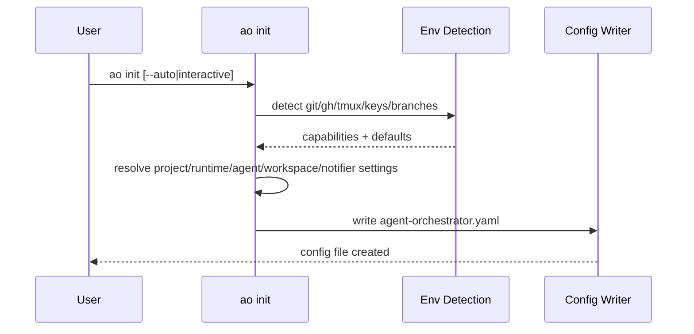
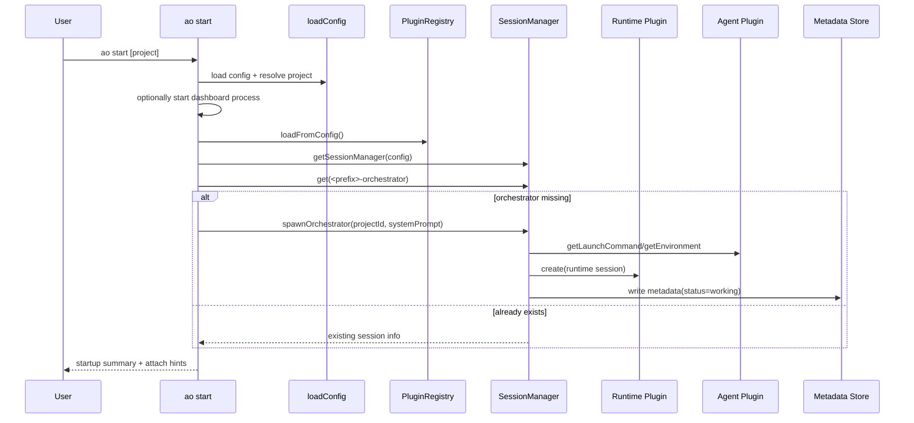
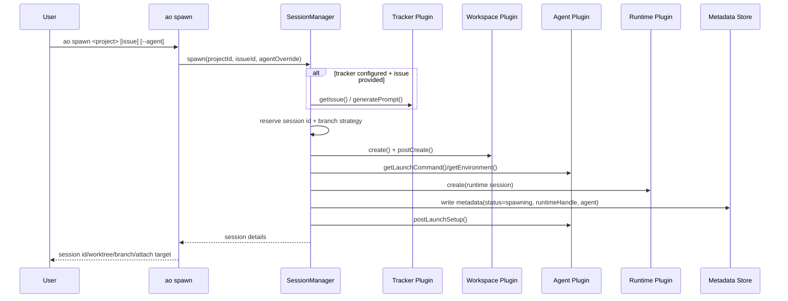
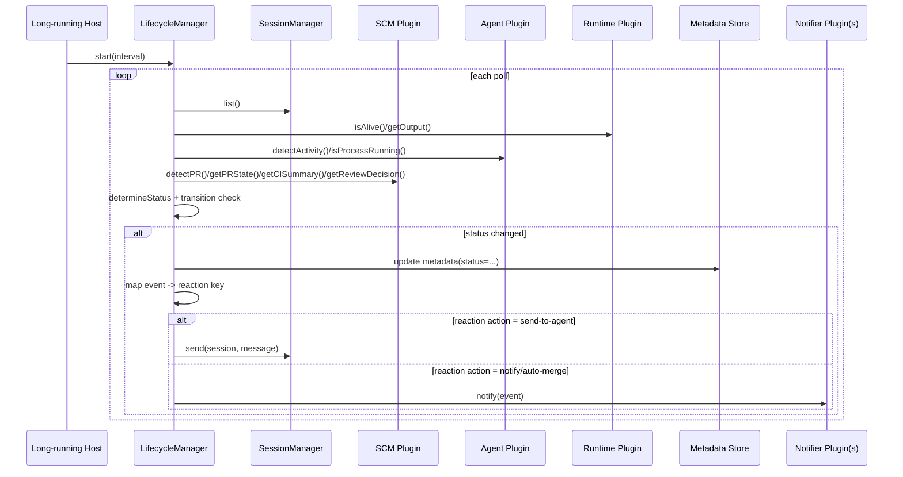
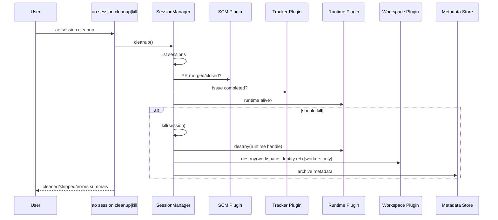

# Agent Orchestrator Architecture One-Pager

Last updated: 2026-02-28

## Purpose

Agent Orchestrator coordinates parallel AI coding agents across isolated workspaces so each session can own its own branch, runtime process, and lifecycle, while humans supervise via CLI/dashboard.

Core goal: move from manual agent babysitting to event-driven orchestration (spawn, monitor, react, notify, cleanup).

## System Layout (Monorepo)

- `packages/core`: source-of-truth contracts, config loading, metadata, session lifecycle, reactions.
- `packages/cli`: `ao` command surface (`init`, `start`, `spawn`, `send`, `session`, etc.).
- `packages/web`: dashboard + API routes, server-side service singleton.
- `packages/plugins/*`: runtime/agent/workspace/tracker/scm/notifier/terminal adapters.
- `packages/agent-orchestrator`: thin global wrapper that exposes `ao`.

## Runtime Model

1. Config is loaded from `agent-orchestrator.yaml` via core.
2. CLI/web create a plugin registry and register/load plugins.
3. `SessionManager` composes tracker + workspace + agent + runtime plugins for session operations.
4. Session metadata is persisted under project-scoped session directories.
5. `LifecycleManager` (when started by a host) polls session/SCM state and executes configured reactions.

## Dependency Direction

1. `ao-core` defines interfaces and orchestration primitives.
2. Plugins implement `ao-core` interfaces.
3. CLI/web compose `ao-core` + plugins.
4. Wrapper package exposes CLI binary.

## Sequence Diagrams

### 1) `ao init` (configuration bootstrap)

Primary code: `packages/cli/src/commands/init.ts`.

### 2) `ao start` (dashboard + orchestrator session)

Primary code: `packages/cli/src/commands/start.ts`, `packages/cli/src/lib/create-session-manager.ts`, `packages/core/src/session-manager.ts`.

### 3) `ao spawn` (worker session creation)

Primary code: `packages/cli/src/commands/spawn.ts`, `packages/core/src/session-manager.ts`.

### 4) Lifecycle polling + reaction execution (core engine)

Primary code: `packages/core/src/lifecycle-manager.ts`.

### 5) Cleanup / kill path

Primary code: `packages/cli/src/commands/session.ts`, `packages/core/src/session-manager.ts`.

## Wired vs Not Wired Matrix

| Capability | Current Status | Evidence |
|---|---|---|
| CLI command registration (`init/start/spawn/session/send/...`) | Wired | `packages/cli/src/index.ts` |
| CLI registry bootstrap via `loadFromConfig()` | Wired | `packages/cli/src/lib/create-session-manager.ts` |
| Core built-in plugin loading (`tmux/codex/github/...`) | Wired | `packages/core/src/plugin-registry.ts` |
| Web plugin loading | Wired (static subset only) | `packages/web/src/lib/services.ts` |
| Session spawn/orchestrator spawn/restore/kill/cleanup/send | Wired | `packages/core/src/session-manager.ts` |
| Metadata persistence and runtime-handle based recovery | Wired | `packages/core/src/metadata.ts`, `packages/core/src/session-manager.ts` |
| Automated lifecycle polling/reactions engine implementation | Implemented | `packages/core/src/lifecycle-manager.ts` |
| Automatic lifecycle engine startup in normal CLI/web runtime | Not wired by default | no non-test `createLifecycleManager(...).start(...)` call path |
| Plugin-specific config extraction (`extractPluginConfig`) | Not wired (stubbed) | `packages/core/src/plugin-registry.ts` |
| Loading extra plugins from config (beyond built-ins) | Not wired (placeholder) | `packages/core/src/plugin-registry.ts` |
| `agent-opencode` package availability in default plugin maps | Not wired | exists in `packages/plugins/agent-opencode`, absent in built-in/CLI maps |
| Review-comment auto-nudge command | Wired (manual trigger) | `packages/cli/src/commands/review-check.ts` |

## Practical Extension Points

1. Add/modify plugin contracts in `packages/core/src/types.ts`.
2. Update config schema/defaults in `packages/core/src/config.ts`.
3. Register built-ins and config mapping in `packages/core/src/plugin-registry.ts`.
4. Wire plugin selection into session/lifecycle flows (`session-manager.ts`, `lifecycle-manager.ts`).
5. If dashboard needs the plugin, add explicit static registration in `packages/web/src/lib/services.ts`.

## Operational Summary

- The architecture is strongly plugin-oriented and session-centric.
- `SessionManager` is fully operational and is the real runtime backbone today.
- `LifecycleManager` is robustly implemented but needs explicit host wiring to become continuously autonomous in production runs.
- Current highest-leverage hardening areas are:
  - lifecycle host bootstrapping,
  - plugin-specific config forwarding,
  - consistency between available plugin packages and built-in registration maps.
